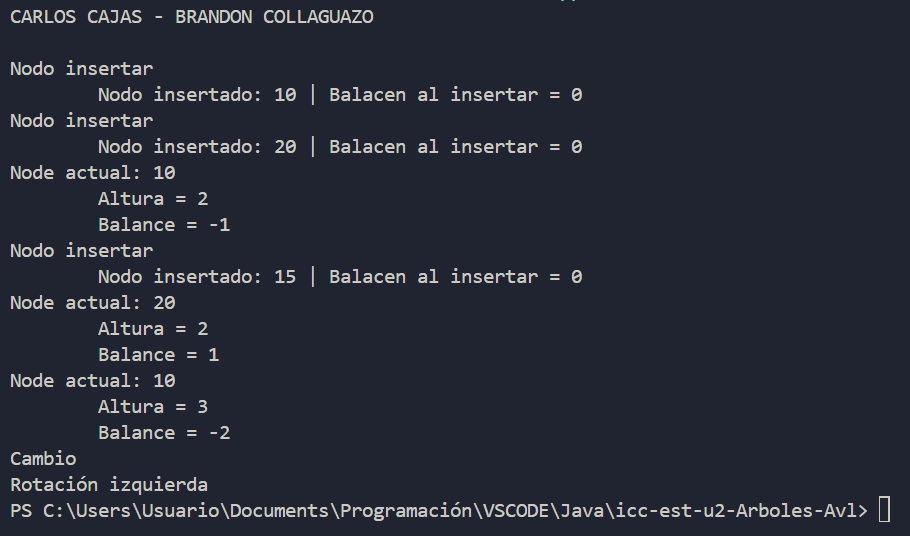

# Práctica En Clase

## 📌 Información General

- **Título:** Árboles AVL
- **Asignatura:** Estructura de Datos
- **Carrera:** Computación
- **Estudiantes:** Brandon Collaguazo, Carlos Cajas
- **Fecha:** 26/06/2025
- **Profesor:** Ing. Pablo Torres

---

## 🛠️ Descripción

Este proyecto implementa un Árbol AVL en Java, una estructura de datos de árbol de búsqueda binario auto-balanceado.

---

## 🧱 Estructura

- **App.java:** Clase principal para ejecutar y probar la inserción en el Árbol AVL.
- **AVLTree.java:** Contiene la lógica para la inserción de nodos, cálculo de altura y factor de balance. Incluye detección de desequilibrios para futuras rotaciones.
- **Node.java:** Define la estructura de un nodo del árbol con valor, altura y referencias a hijos.

---

## ⚙️ Funcionalidades

- **Inserción de Nodos:** El método insert() en AVLTree.java maneja la adición de nuevos elementos.
- **Cálculo de Altura:** La función height() determina la altura de un subárbol.
- **Factor de Balance:** La función getBalance() calcula el factor de balance de un nodo, crucial para identificar desequilibrios.
- **Detección de Rotaciones:** El código identifica los casos de desequilibrio (Izquierda-Izquierda, Derecha-Derecha, Izquierda-Derecha, Derecha-Izquierda) e indica qué rotación sería necesaria.

---

## 🚀 Resultado

  

